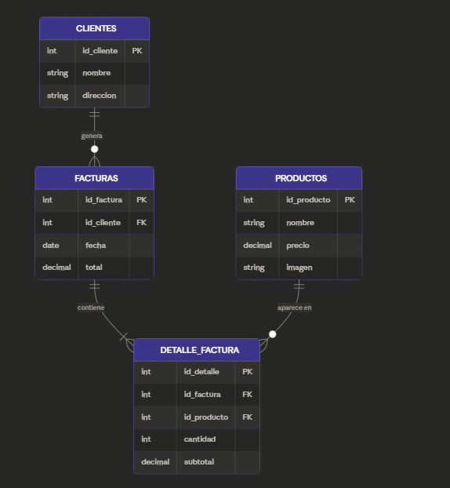
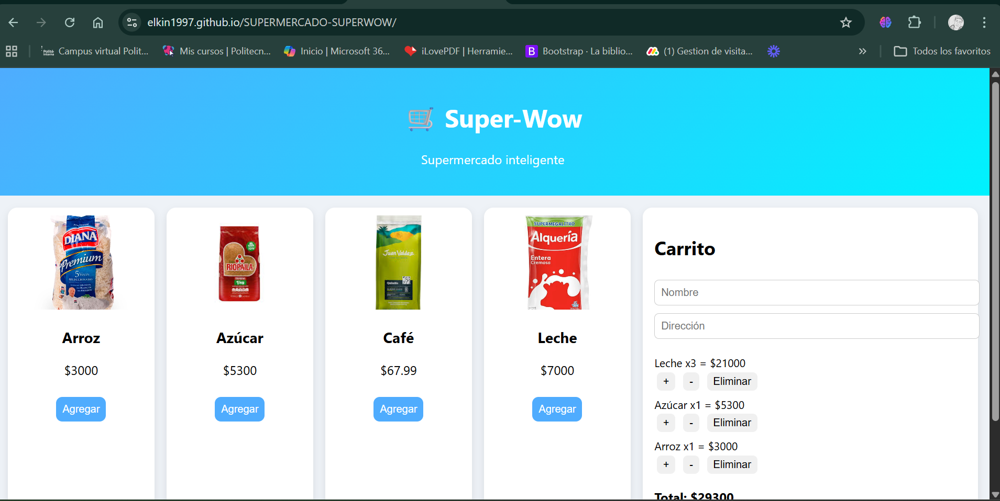
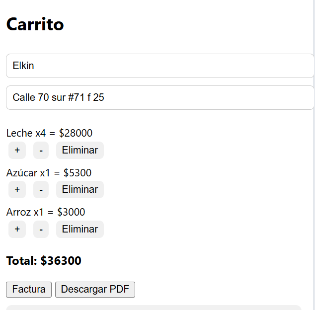
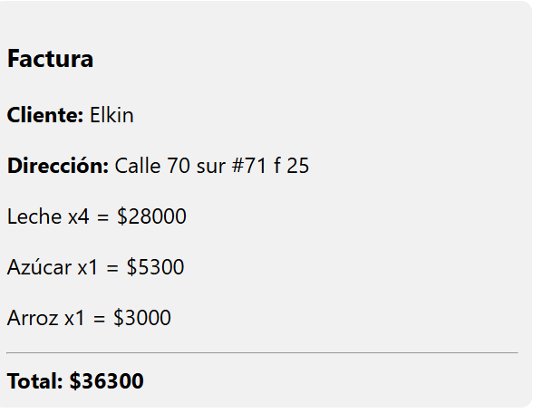
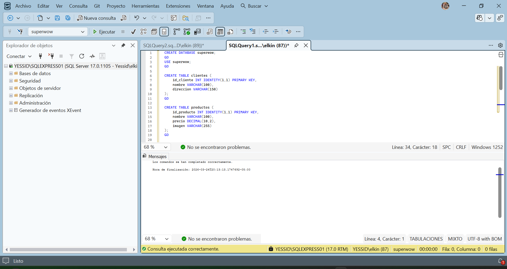
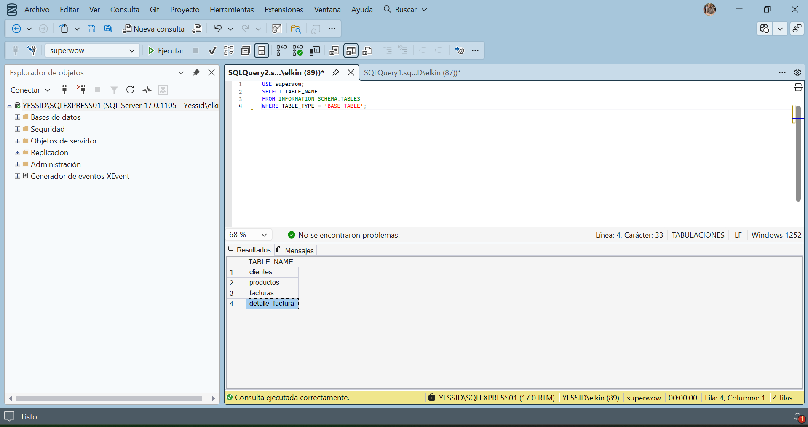

# 🛒 Super-Wow

Sistema de supermercado inteligente que permite agregar productos a un carrito, generar facturas y calcular totales automáticamente.

---

## 📊 Modelo Entidad-Relación

---

## 📸 Evidencia del funcionamiento

### Interfaz del sistema

### Carrito de compras

### Factura generada

### Base de datos en MySQL

## 🗄️ Base de Datos en MySQL

## 🧠 Descripción del Sistema

El sistema permite:

- Agregar productos al carrito
- Modificar cantidades
- Eliminar productos
- Generar factura
- Descargar factura en PDF

---

## 🗂️ Base de Datos

El sistema utiliza MySQL con las siguientes tablas:

- clientes
- productos
- facturas
- detalle_factura

---

## 📘 Diccionario de Datos

### 🧾 Clientes
- id_cliente: identificador único
- nombre: nombre del cliente
- direccion: dirección del cliente

### 🛒 Productos
- id_producto: identificador único
- nombre: nombre del producto
- precio: precio del producto
- imagen: ruta de la imagen

### 🧾 Facturas
- id_factura: identificador único
- id_cliente: cliente asociado
- fecha: fecha de compra
- total: valor total

### 📦 Detalle Factura
- id_detalle: identificador único
- id_factura: factura asociada
- id_producto: producto
- cantidad: cantidad comprada
- subtotal: total por producto

---

## ⚙️ Tecnologías usadas

- HTML
- CSS
- JavaScript
- MySQL

---

## 🚀 Cómo ejecutar el proyecto

1. Clonar el repositorio
2. Abrir el archivo index.html en el navegador
3. (Opcional) configurar base de datos en MySQL

---
